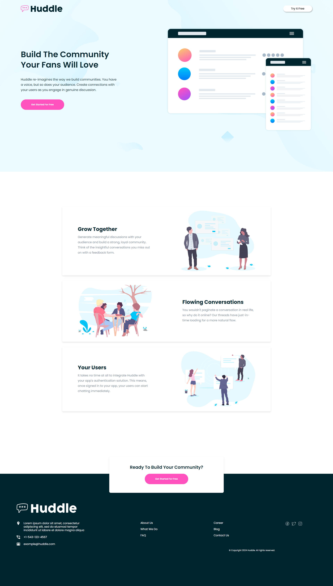

## Challenge: Build a fully Responsive Website using Using HTML and CSS

### 🚀Different Screen Sizes Tested!

#### Laptop View

#### Tab View

#### Phone View

1. **Use Responsive Units:** Prefer using percentages, `em`, and `rem` units instead of fixed `px` units to make your layout more flexible.
2. **Media Queries:** Utilize CSS media queries to apply different styles at different screen sizes.
3. **Flexible Images:** Ensure that images scale properly within their containers. You can achieve this with the `max-width: 100%;` CSS rule.
4. **Mobile-First Approach:** Start designing for the smallest screen size and work your way up. This approach helps in creating a more efficient and cleaner codebase.

### Useful Resources

- [MDN Web Docs on Responsive Design](https://developer.mozilla.org/en-US/docs/Learn/CSS/CSS_layout/Responsive_Design)
- [W3Schools Responsive Web Design Tutorial](https://www.w3schools.com/css/css_rwd_intro.asp)
- [A Complete Guide to Flexbox](https://css-tricks.com/snippets/css/a-guide-to-flexbox/)
- [A Complete Guide to Grid](https://css-tricks.com/snippets/css/complete-guide-grid/)
